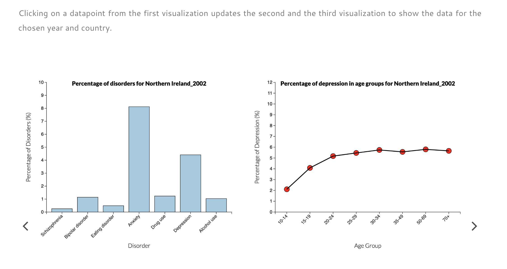

# Final Project
## Introduction
This directory serves as the home for hosting the visualizations for the final project. This project titled as "Mental Health Disorders Across the World" is an attempt to visualize facts and statistics about mental health using D3.js library.

## Instructions Manual
In order to understand how to use the visualizations and their interactions, please refer to the instructions slider inside the `index.html` as shown below:



## Directory Structure
Here is the structure of this directory:
```
finalProject/
├─ assets/
├─ data/
├─ screenshots/
├─ index.html
├─ plots.html
├─ README.md
```
and here is the explanation for each file and directory:
- `assets/` is a directory that holds the styles and images required for the HTML template used for this project.
- `data/` is a directory that holds the 4 CSV datasets used in the visualizations.
- `screenshots/` holds the screenshots required for the instructions slider.
- `index.html` is the main file for hosting the visualizations.
- `plots.html` is the file that contains SVGs for the 4 visualizations in this project.
- `README.md` is this file

## Development
### Requirements
Here are the libraries used:
- D3 v7
- ColorBrewer v2
- D3 Annotations
- D3 Legend V2.25

All the required libraries are imported in the code already and no installment is necessary. 

### Testing Locally
You can easily make changes to any of the files and data mentioned above and watch the results get updated. To run a local version of the website, it is recommended to use extensions like `Live Server` for `VS Code` and launch a live server, otherwise opening up the `index.html` file in a browser (mainly Chrome) might give you a `CORS` error.

## Deployment
By making changes and committing and pushing them, the changes would take effect on `https://fika005.github.io/finalProject/`